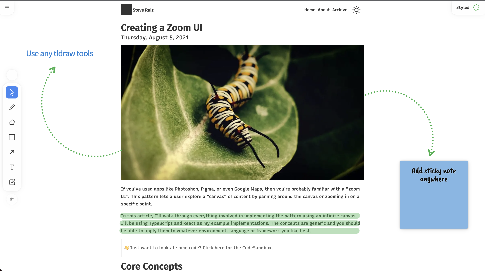

# tldrawe

A [chrome](https://chrome.google.com/webstore/detail/mhkmpnjdjhckmcejgmajnjhbmclmkdnd) / [firefox](https://addons.mozilla.org/addon/tldrawe/) extension to draw on any webpage with tldraw.

# Development

From the root folder:

- Run `yarn` to install dependencies.

- Run `yarn build` to build the extension and the tldraw package.

- Chrome:

  - Go to `chrome://extensions/` in your browser.
  - Enable developer mode and select `Load Unpacked` and load the `dist` folder.

- Mozilla:

  - Go to `about:debugging#/runtime/this-firefox` in your browser
  - Select `Load Temporary Add-on...` and select any file inside the `dist` folder.

- Navigate to a website and use the keyboard shortcut `CMD/CTRL + SHIFT + e` to enable the extension.
